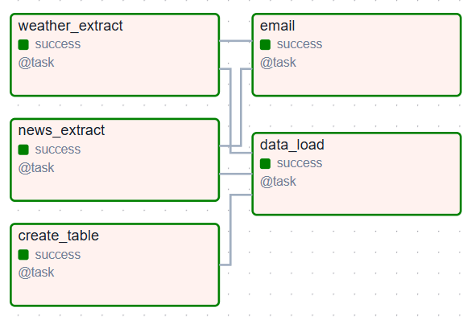

# Report of daily_weather-news-Budapest_ETL_pipeline

## 1. Adding Custom Dependencies

To integrate the `openmeteo_requests` package for the weather API, follow these steps:

### Step 1: Define `requirements.txt`

Create a `requirements.txt` file to list all necessary dependencies, including `openmeteo_requests`.

### Step 2: Modify the Docker Setup

1. Create a new `Dockerfile` in the same directory based on the `apache/airflow` image to install the required dependencies.
2. Update the `docker-compose` configuration:
   - Uncomment the `build: .` line.
   - Comment out the `image: ${AIRFLOW_IMAGE_NAME:-apache/airflow:2.10.5}` line.
3. **Note:** Do not build the new `Dockerfile` separately.

### Step 3 Set customized environment variable

Environment variable is safer than airflow variable
It's also better in performance since airflow will need to readout from meta database to use the airflow variable, which is a waste.

Add the following to docker-compose/x-airflow-common

```bash
  env_file:
    - .env
```

### Step 4: Build and Deploy

Run the following commands to build and start the Airflow environment with the updated dependencies:

```bash
docker compose up --build airflow-init
docker compose up
```

And if we down and up 2nd time, then do we need add --build?
-- No we don't. Rebuild only when we add new dependencies

```bash
docker compose up airflow-init
docker compose up
```

## 2. Implementation details

Waether & News API -> ETL -> Postgres



Issues when sending emails failed for both Gmail and Hotmail. Suspect that they have increased security restrictions on third-party logins. Also unable to use SendGrid due to a lack of permissions. Hold this part for now.
